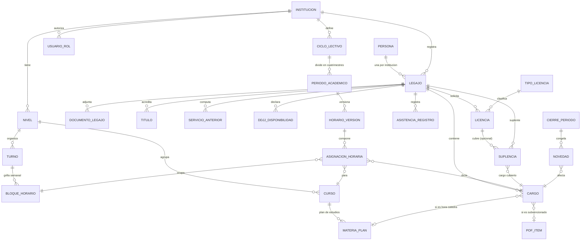

# SGE — Sistema de Gestión para Secretaría Escolar

> **Documento de requerimientos** · Versión 1.3 · Agosto 2026
> Estado de implementación: **F0 (fundaciones) lista**; siguiente F1 (RRHH).
> Nombre comercial: a definir (SGE es nombre de trabajo).
> Este es un documento vivo: se actualiza a medida que se toman decisiones. Sirve como fuente de verdad para las sesiones de desarrollo con Claude Code.

---

## 1. Visión del producto

Aplicación web para la **secretaría de escuelas de gestión privada** que resuelve la operación diaria del personal docente: legajos (RRHH), horarios, asistencia, licencias, suplencias y la **generación de las novedades mensuales para la liquidación de sueldos**.

- **Primer cliente y caso de validación:** la institución donde trabaja el autor — escuela privada **subvencionada** de la provincia de **San Luis** (Argentina), con niveles inicial, primaria y secundaria.
- **Ambición comercial:** producto **SaaS multi-institución**, para ofrecer a otras escuelas. Toda decisión de diseño debe evitar hardcodear la realidad de una sola escuela: lo específico (régimen de licencias, formatos de planillas, estructura horaria) se resuelve por **configuración por institución**.
- **Estrategia de alcance:** la versión 1 se enfoca en el **nivel secundario** (el más complejo por las horas cátedra), pero el modelo de datos contempla desde el inicio los tres niveles para incorporarlos después sin rediseño.

### 1.1 Qué NO hace (fuera de alcance)

- **No liquida sueldos.** Calcula y compila *novedades*; los sueldos los liquidan el estado (aporte estatal) y el liquidador de la escuela, que arma las planillas Oficial e Interna a partir de lo que la escuela le informa.
- No gestiona alumnos en lo académico (notas, boletines, legajos de alumnos), ni comunicación con familias, ni facturación de cuotas, ni inventario. Los cursos/divisiones existen solo como estructura para los horarios.

---

## 2. Contexto del dominio

### 2.1 La escuela privada subvencionada

En una escuela privada subvencionada conviven **tres situaciones de pago**:

| Tipo de personal | Quién paga el sueldo | En qué planilla se informa |
|---|---|---|
| **Subvencionado** | El estado provincial (aporte estatal) | **Planilla Oficial** |
| **Interno** | La escuela | **Planilla Interna** |
| **Mixto** | Una misma persona tiene cargos u horas de ambos orígenes | Cada cargo en su planilla |

En el piloto, **ambas planillas las arma el liquidador externo**: la escuela solo le informa ausencias, altas y bajas, rotulando cada novedad como Oficial o Interna. No hay rendición directa de la escuela al estado. Para otras escuelas que sí rindan directo, el destino/formato de salida es configurable (fase SaaS).

**Regla de modelado central:** la fuente de pago **no es un atributo de la persona sino de cada cargo/hora**. El caso "mixto" emerge naturalmente cuando una persona tiene cargos con distintas fuentes. Toda novedad hereda la fuente de pago del cargo que la origina y se enruta al destino correcto.

### 2.2 Circuito actual de novedades (a reemplazar/asistir)

Hoy la secretaría carga cada novedad **manualmente en un Google Sheet compartido del liquidador, a través de un link de Google Forms** (formulario "Novedades Sueldos"). El formulario real fue relevado y está documentado en el **Anexo A**: campos exactos, valores observados y volumetría (~40 novedades/mes). El sistema debe:

1. **v1:** compilar las novedades del mes y presentarlas listas para trasladar a ese circuito (export con las mismas columnas del Anexo A, checklist de "informada").
2. **v2:** automatizar el traslado (links de Google Forms pre-llenados por novedad y/o escritura directa en el Sheet vía API).

**Regla vigente del liquidador:** solo se informan las novedades que **generan descuento o pago adicional** (antes se cargaban datos de más y se dejó de hacer). El sistema registra todo, pero el paquete a informar filtra por impacto en haberes.

### 2.3 Glosario

| Término | Significado |
|---|---|
| **Legajo** | Carpeta administrativa de un empleado en la institución: datos, cargos, documentación, historial. |
| **Cargo** | Puesto que ocupa una persona: un cargo de base (p. ej. maestro de grado, preceptor) o un paquete de **horas cátedra** (materia + curso). |
| **Hora cátedra** | Unidad de designación en secundaria: se designa por cantidad de horas semanales en una materia y curso. En el piloto dura **40 minutos**; los preceptores computan **horas reloj de 60 minutos** — la unidad depende del tipo de cargo. |
| **Situación de revista** | Condición del cargo: **titular**, **provisional/interino** o **suplente**. |
| **Fuente de pago** | Origen del sueldo del cargo: **subvencionado** (estado) o **interno** (escuela). |
| **POF** | Planta Orgánica Funcional: cargos y horas aprobados/financiados por el estado para la escuela. En el piloto no hay un documento POF único: la planta consta por **resoluciones individuales por cargo**, que el sistema registra en cada cargo. |
| **DDJJ (declaración jurada) de horarios** | Declaración del docente de sus horarios ocupados en otras instituciones y disponibilidad; insumo para armar horarios y controlar incompatibilidades. |
| **Novedad** | Todo hecho del mes que afecta la liquidación: alta, baja/cese, licencia, inasistencia, llegada tarde, suplencia, cambio de situación de revista o de horas. |
| **Contralor** | Rendición/informe periódico al organismo estatal que financia los cargos subvencionados. |
| **Parte diario** | Registro de asistencia del personal de un día. |
| **Alumnos libres** | Horas sin docente ni suplente asignado: el curso queda sin clase. |

---

## 3. Usuarios y roles

| Rol | Permisos principales |
|---|---|
| **Secretaría** | Operación completa: legajos, cargos, horarios, asistencia, licencias, suplencias, novedades, cierres. Es el usuario principal del sistema. |
| **Equipo directivo** | Consulta de todo, tableros e indicadores, aprobación de licencias, firma de certificaciones. |
| **Docente** (fase portal) | Autoservicio: ver su horario, su legajo y documentación, avisar inasistencias, solicitar licencias con adjuntos, fichar (objetivo). |
| **Contador / liquidador** | Solo lectura del paquete de novedades de períodos cerrados; descarga de exports. |
| **Admin del producto** (interno) | Alta y configuración de instituciones (multi-tenant), soporte. |

Los roles se asignan **por institución** (una misma persona podría ser docente en una escuela y directivo en otra).

---

## 4. Módulos funcionales

### M1 · RRHH / Legajos

**Objetivo:** legajo digital completo de cada empleado, con alertas de vencimientos y generación de certificaciones.

**Funciones:**

- ABM de personas y legajos: datos personales (CUIL, DNI, contacto, domicilio, obra social), foto, estado (activo/baja).
- **Cargos** por legajo, cada uno con: tipo (cargo de base / horas cátedra de 40' / horas reloj de 60' — preceptores), nivel, materia y curso (si aplica), cantidad de horas semanales, **situación de revista** (titular / provisional / suplente), **fuente de pago** (subvencionado / interno), fecha de alta y de baja/cese, y **resolución de designación** (número, fecha, adjunto): en el piloto la planta aprobada por el estado consta por resoluciones individuales por cargo, así que la resolución es el respaldo del control "grilla vs. planta".
- **Documentación con vencimientos:** apto psicofísico, certificado de antecedentes penales, títulos registrados, etc. Cada documento: tipo, archivo adjunto, fecha de emisión y de vencimiento. **Alertas configurables** (p. ej. 30/60 días antes de vencer).
- **Títulos y formación:** títulos, postítulos y cursos, con puntaje/incumbencias como texto libre en v1.
- **Historial de servicios:** todos los períodos trabajados en la institución (por cargo, con situación de revista) + carga manual de **servicios anteriores en otras instituciones** para el cómputo de **antigüedad docente** (el porcentaje lo aplica quien liquida; el sistema informa años/meses/días).
- **Certificación de servicios (PDF):** documento generado por persona que lista todos los períodos de servicio con cargo, horas, **situación de revista (titular/suplente) visible por período**, desde/hasta, con membrete de la institución y espacio de firma del directivo. Requisito explícito del cliente.

**Historias de usuario:**

- Como secretaria, cargo un docente nuevo con sus horas (12 hs de Matemática en 2°A y 2°B, subvencionadas, provisional) en menos de 5 minutos.
- Como secretaria, veo en el tablero qué documentación vence este mes y a quién reclamársela.
- Como secretaria, genero la certificación de servicios de un docente que la pide para la junta o ANSES, sin armarla a mano en Word.

### M2 · Horarios (secundaria primero)

**Objetivo:** armar y mantener los horarios del colegio; **generarlos automáticamente** a partir de las DDJJ y restricciones. Es la funcionalidad diferencial del producto.

**Estructura previa (configuración por institución):**

- Ciclo lectivo (año), dividido en **cuatrimestres** (algunas materias cambian cuatrimestralmente).
- Turnos y grilla de **bloques horarios** configurables por día y por curso. Realidad del piloto: turno mañana; hora cátedra de **40 min**; las horas van **de a pares (2×40')** con recreos de duración **variable** según el momento de la mañana; **algunos cursos tienen bloque de almuerzo y otros no**. La grilla debe ser flexible — bloques por día, bloques especiales (recreo/almuerzo) y variaciones por curso — sin asumir una grilla uniforme. El detalle fino (horarios exactos de cada bloque) se carga como configuración al implementar, con la grilla real de la escuela a la vista.
- Cursos/divisiones por nivel y turno (p. ej. 3°A TM).
- **Plan de estudios por curso:** materias con carga horaria semanal y vigencia (anual / 1er cuatrimestre / 2do cuatrimestre).
- Asignación docente ↔ materia ↔ curso (derivada de los cargos del M1).
- Recursos compartidos opcionales (canchas, laboratorios) para restricciones.

**DDJJ y restricciones (insumos del generador):**

- Por docente y cuatrimestre: **bloques no disponibles** (horarios en otras escuelas, según su DDJJ) y preferencias.
- Restricciones institucionales configurables: materia fijada a ciertos bloques, máximo de horas seguidas de una misma materia, materias que no pueden compartir recurso (p. ej. dos cursos en la cancha), etc.
- Alerta de DDJJ faltantes antes de generar.

**Generador automático (motor de optimización):**

- *Restricciones duras (obligatorias):* cada curso recibe todas las horas de su plan con el docente designado; un docente no está en dos cursos en el mismo bloque; un curso no tiene dos materias en el mismo bloque; se respetan las DDJJ y las restricciones institucionales.
- *Objetivos blandos (ponderados, configurables):*
  1. **Minimizar la cantidad de días que cada docente debe asistir** (compactar sus horas en pocos días) — prioridad n° 1 pedida por el cliente.
  2. Minimizar "huecos" (horas libres intermedias) de los docentes.
  3. Distribuir una misma materia en días distintos (criterio pedagógico).
  4. Respetar preferencias declaradas.
- El resultado es un **borrador editable**: la secretaría ajusta a mano con **validación en vivo de choques**, puede **bloquear** lo que está bien y **regenerar solo el resto**.
- Corre como tarea en segundo plano con barra de progreso (puede tardar minutos).

**Vigencia y versiones:**

- Cada horario tiene estado (borrador / vigente / histórico) y **vigencia desde/hasta**; el cambio de cuatrimestre publica una nueva versión sin perder la anterior.
- El parte diario y los reportes siempre usan el horario vigente a la fecha.

**Vistas e impresión:**

- Grilla por curso, grilla por docente, horas sin cubrir, disponibilidad de recursos.
- Export a PDF imprimible para carteleras y a Excel.

**Historias de usuario:**

- Como secretaria, cargo las DDJJ de los profesores, aprieto "Generar" y obtengo un horario sin choques donde cada profesor viene la menor cantidad de días posible.
- Como secretaria, al empezar el 2° cuatrimestre publico el horario nuevo (cambian dos materias) y el anterior queda archivado.
- Como directivo, imprimo el horario de cada curso para la cartelera.

### M3 · Asistencia docente

**Objetivo:** registrar la asistencia diaria del personal contra lo que *debería* pasar según el horario vigente.

**Funciones:**

- **Parte diario autogenerado:** para cada fecha, el sistema arma la lista de quién debe estar, en qué bloques, en qué curso — a partir del horario vigente, descontando titulares con licencia y agregando suplentes activos.
- **Carga por secretaría (v1, circuito actual):** desde el libro de firmas/parte en papel, la secretaría marca por docente y día: presente / ausente / llegada tarde / retiro anticipado / **ausencia parcial** (faltó a algunas horas), indicando las horas afectadas.
- Justificación: una ausencia se vincula a una **licencia** (justificada) o queda **injustificada** (impacta en novedades).
- **Aviso previo del docente (fase portal):** el docente notifica desde la app que faltará, con motivo; secretaría confirma y clasifica.
- **Fichaje por app (objetivo, fase portal):** el docente marca presente desde su celular al llegar, con controles (ventana horaria y geolocalización dentro de la escuela).
- Reportes: inasistencias del mes por docente, por cargo y **por fuente de pago**; ranking de ausentismo; llegadas tarde acumuladas.

**Historias de usuario:**

- Como secretaria, cada mañana abro el parte del día ya armado y solo marco los que faltaron.
- Como secretaria, al fin de mes veo cuántos días faltó cada docente en cada cargo, separado por lo subvencionado y lo interno.

### M4 · Licencias

**Objetivo:** gestionar el ciclo completo de licencias con un catálogo configurable por institución/jurisdicción.

**Funciones:**

- **Catálogo de tipos de licencia** configurable: código, denominación, referencia normativa (artículo/inciso del régimen de San Luis en el primer cliente), con/sin goce de haberes, **si impacta en haberes** (descuento/pago adicional), tope de días por año/por caso, si requiere certificado, si es de corto o largo tratamiento.
- **Precarga del catálogo con los motivos y artículos reales en uso** (tabla de la secretaría, ver Anexo A.3): Art. 76 Enfermedad/Estudio médico, Art. 83 Maternidad, Art. 91 Atención de Familiar, Art. 93.1 Matrimonio (12 días), Art. 93.2 Fallecimiento Familiar, Art. 93.3 Nacimiento de Hijo (padre), Art. 93.4 Razones Particulares, Art. 94.1 Exámenes, Art. 97 Congresos y Jornadas, Art. 98 Deportiva, Art. 100 Cargo de Mayor Jerarquía, Art. 107 Binomio Madre-Hijo, Licencias Especiales (art. variable, en general las únicas **sin goce**), Relevo de funciones. En general las licencias son **con goce** ("muy pocas sin goce, se pagan"). Los topes principales ya están relevados en A.3; faltan solo los de los motivos menos usados. Tardanza/Retiro anticipado figura en la tabla actual pero se registra por el módulo de asistencia (M3), no como licencia.
- Solicitud de licencia: por secretaría (v1) o por el docente desde el portal (fase 2), sobre uno o más cargos del legajo, con período desde/hasta, adjuntos (certificados médicos) y observaciones.
- Flujo de estados: solicitada → aprobada/rechazada (directivo) → en curso → finalizada; prórrogas/extensiones encadenadas.
- Control automático de **topes** al cargar: por año, por caso y por **días consecutivos** (p. ej. Exámenes: 20/año y máx. 5 seguidos), con aviso cuando la solicitud excede el saldo.
- **Extensiones con aval:** los tipos que lo permiten (p. ej. Enfermedad más allá de los 60 días anuales, con **junta médica**) se registran como prórroga encadenada con el respaldo adjunto.
- Impacto automático: los días de licencia justifican las ausencias del período y generan la **novedad** correspondiente (con o sin goce).

### M5 · Suplencias

**Objetivo:** cubrir (o decidir no cubrir) las horas de un docente con licencia, y generar las novedades de alta y cese del suplente.

**Reglas del cliente:** las licencias **largas generalmente se cubren**; algunas por día también; otras **no se cubren y los alumnos quedan libres**. Por lo tanto la cobertura es **opcional y por decisión de la escuela**, nunca automática.

**Funciones:**

- Desde una licencia aprobada, decidir por cada cargo/hora afectada: **designar suplente** o **marcar "sin cobertura"** (alumnos libres, visible en el parte diario y en reportes).
- Designación de suplente: persona existente o alta express de una nueva (mini-legajo a completar después); período desde/hasta (puede ser menor a la licencia), horas que cubre.
- El suplente **hereda el horario** de las horas cubiertas: aparece en el parte diario y en las grillas mientras dure la suplencia.
- Novedades automáticas: **alta de suplente** al inicio y **cese** al fin (o al reincorporarse el titular), con días/horas trabajados, enrutadas según la fuente de pago del cargo cubierto.
- Alertas de suplencias por vencer (preaviso de cese).

### M6 · Novedades y cierre mensual

**Objetivo:** compilar automáticamente todas las novedades del período y entregarlas separadas por destino, con un cierre auditable. Es el módulo que le ahorra más tiempo a la secretaría.

**Tipos de novedad (mínimo v1):**

| Novedad | Origen |
|---|---|
| Alta de cargo / aumento de horas | M1 (cargos) |
| Baja: renuncia / cese / reducción de horas | M1 (cargos) |
| Cambio (situación de revista, horas, cargo) | M1 (cargos) |
| Licencia con goce / sin goce (días) | M4 |
| Inasistencia injustificada (días/horas) | M3 |
| Llegadas tarde (cantidad) | M3 |
| Alta de suplente / cese de suplente (días trabajados) | M5 |
| Novedad manual (texto libre + importe/días) | Carga directa |

> Coinciden con los tipos que ya usa el circuito real (Anexo A.2): *Licencia, Alta, Cese, Renuncia, Cambio*. Cada tipo lleva el flag **impacta haberes**: por defecto el paquete a informar incluye solo las novedades que generan descuento o pago adicional; el resto queda como registro interno.

**Funciones:**

- **Compilación automática** del período (mes/año): el sistema recorre cargos, licencias, asistencia y suplencias y arma el listado de novedades por persona y cargo.
- **Separación por destino** según fuente de pago del cargo, con la terminología del circuito real: **"Planilla Oficial"** (cargos subvencionados) y **"Planilla Interna"** (cargos internos). El personal mixto aparece en ambas, cada cargo en la suya. En el relevamiento: ~88% Oficial, ~12% Interna. En el piloto **ambas planillas las arma el liquidador**: el sistema entrega un único paquete con cada novedad ya rotulada (hoy ese rótulo lo decide la secretaría a mano; el sistema lo deriva del cargo y elimina errores de ruteo).
- **Pre-cierre:** pantalla de revisión con checklist; la secretaría corrige/agrega novedades manuales antes de cerrar.
- **Cierre del período:** congela las novedades (inmutables), registra quién y cuándo cerró; reapertura solo con permiso de directivo y quedando auditado.
- **Salidas v1:**
  - Export **Excel/CSV con mapeo de columnas configurable** para calzar exactamente con el Google Sheet del liquidador (copy-paste directo; columnas relevadas en Anexo A.2).
  - **PDF** resumen del período para firmar/archivar/elevar.
  - Checklist de carga: marcar cada novedad como **"informada"** (con fecha y usuario) para no perder el hilo del circuito manual actual.
  - Acceso del **contador** (rol solo lectura) para descargar el paquete de períodos cerrados.
- **Salidas v2 (automatización del circuito actual):**
  - Generación de **links de Google Forms pre-llenados** por novedad (template de URL con IDs de campos configurable): un click por novedad en lugar de tipear todo.
  - Escritura directa al Google Sheet vía API (cuando el liquidador lo permita).
  - ~~Réplica de planilla oficial de contralor~~ → **no aplica al piloto**: el liquidador arma todas las planillas; la escuela solo informa ausencias, altas y bajas. Si una futura escuela cliente rinde directo al estado, su formato se agrega como export configurable (F6).

### M7 · Tablero y alertas

- Tablero de secretaría/directivo: ausentismo del mes, licencias en curso, horas sin cobertura hoy (alumnos libres), documentación por vencer, suplencias por vencer, DDJJ faltantes, novedades pendientes de informar.
- Notificaciones: en la app v1; por email en fase 2.

---

## 5. Modelo de datos (borrador)

Todas las tablas de negocio llevan `institucion_id` (multi-tenant de base única). Diagrama de entidades principal:



**Campos clave por entidad (resumen):**

- `CARGO`: tipo (cargo_base | horas_catedra | horas_reloj), unidad_hora (40' | 60'), horas_semanales, situacion_revista (titular | provisional | suplente), **fuente_pago (subvencionado | interno)**, fecha_alta, fecha_baja, resolucion (número, fecha, adjunto).
- `TIPO_LICENCIA`: codigo, nombre, referencia_normativa, con_goce (bool), impacta_haberes (bool), tope_dias_anual, tope_dias_por_caso, tope_dias_consecutivos, extensible_con_aval (p. ej. junta médica), requiere_certificado.
- `DDJJ_DISPONIBILIDAD`: legajo, periodo_academico, bloques_no_disponibles, observaciones, archivo adjunto.
- `HORARIO_VERSION`: periodo_academico, estado (borrador | vigente | historico), vigencia_desde, vigencia_hasta.
- `ASISTENCIA_REGISTRO`: legajo, cargo, fecha, estado (presente | ausente | tarde | retiro | parcial), horas_afectadas, licencia_id (nullable → injustificada si es null y ausente).
- `NOVEDAD`: periodo (mes/año), legajo, cargo, tipo, dias, horas, detalle, **destino (contralor_estatal | liquidacion_interna)** derivado de fuente_pago, estado (pendiente | informada), informada_por/fecha.
- `CIERRE_PERIODO`: mes/año, estado (abierto | cerrado | reabierto), cerrado_por, timestamp.

---

## 6. Arquitectura técnica

Elegida para un desarrollador solo, con Claude Code, y lista para crecer a SaaS.

| Capa | Elección | Motivo |
|---|---|---|
| Backend | **Python 3.12 + Django 5** | Admin gratis para soporte, ORM sólido, ecosistema maduro, ideal para CRUD pesado. |
| Base de datos | **PostgreSQL 16** | Multi-tenant confiable, integridad referencial. |
| Frontend | **Templates Django**; CSS propio self-hosted en F0. HTMX/Alpine y, si hace falta, Tailwind se suman cuando la interfaz lo pida (F1+) | Un solo deploy, sin SPA que mantener. Sin build ni CDN, el sistema anda con internet intermitente — algo real en una escuela. |
| Portal docente | La misma web, **responsive + PWA** (manifest + service worker) | Instalable en el celular del docente sin app stores; geolocalización vía API del navegador para el fichaje. |
| Generador de horarios | **Google OR-Tools (CP-SAT)** | Estado del arte en timetabling; modela restricciones duras y objetivos ponderados (minimizar días de asistencia). |
| Tareas en segundo plano | v1: **hilos/cola en base de datos** (sin Redis); luego django-rq + Redis | Generador y PDFs fuera del request. Sin Redis se puede desplegar gratis con menos memoria; se migra cuando haya hosting pago. |
| PDFs | **WeasyPrint** | Certificaciones y planillas desde HTML/CSS. |
| Excel | **openpyxl** | Exports de novedades y horarios. |
| Autenticación | Django estándar con **login por email** (F0). `django-allauth` queda para F5 si el portal docente necesita autogestión | Roles por institución, traducidos a grupos de permisos de Django. |
| Multi-tenant | **Base única con `institucion_id`** en todo modelo de negocio + middleware/manager que fuerza el scoping | Simple de operar; suficiente hasta decenas de escuelas. |
| Adjuntos | Disco local (volumen) en v1; S3-compatible después | |
| Deploy | **Docker Compose**; arranque a **costo $0** (requisito del cliente): VPS gratuito tipo Oracle Cloud Always Free, o PC de la escuela + Cloudflare Tunnel | Mismo compose migrable a un VPS pago (~USD 10/mes) cuando el producto tenga clientes. |
| Backups | `pg_dump` diario + copia off-site | Datos laborales sensibles. |
| Tests / CI | **pytest-django** + GitHub Actions | Los cálculos de novedades y el generador exigen tests. |
| Idioma / TZ | es-AR · `America/Argentina/San_Luis` | |

**Estructura de apps Django sugerida:**

```
sge/
├── core/        # tenancy, instituciones, usuarios, roles, auditoría, configuración
├── estructura/  # niveles, ciclos, cuatrimestres, turnos, bloques, cursos, materias
├── legajos/     # personas, legajos, cargos, documentación, títulos, servicios, certificaciones
├── horarios/    # DDJJ, restricciones, versiones, generador CP-SAT, vistas/exports
├── asistencia/  # parte diario, registros, justificaciones
├── licencias/   # catálogo de tipos, solicitudes, flujo, suplencias
├── novedades/   # compilación, cierres, exports, mapeo de columnas, checklist
└── portal/      # PWA docente: horario, avisos, solicitudes, fichaje
```

**Seguridad y cumplimiento:**

- Datos personales y de salud (certificados médicos): acceso restringido por rol, cifrado en tránsito (TLS), backups protegidos. Marco: Ley 25.326 de Protección de Datos Personales.
- **Auditoría**: log inmutable de acciones sensibles (cierres de período, reaperturas, ediciones de novedades, cambios de cargos).
- Los cierres de período son inmutables salvo reapertura autorizada y auditada.

---

## 7. Roadmap por fases

Cada fase termina con algo usable en la escuela real. Sirven como unidades de trabajo para sesiones de Claude Code.

| Fase | Contenido | Resultado usable |
|---|---|---|
| **F0 · Fundaciones** ✅ | Proyecto Django, Docker, CI, auth, multi-tenant, roles con permisos, auditoría, ABM de institución, niveles, ciclo lectivo, cuatrimestres, turnos, grilla horaria, cursos, materias y plan de estudios. | **Hecha.** Estructura del colegio cargada. |
| **F1 · RRHH** | Personas, legajos, cargos con fuente de pago y situación de revista, documentación con vencimientos y alertas, títulos, servicios, **certificación de servicios PDF**. | Reemplaza las carpetas y planillas de legajos. |
| **F2 · Horarios** | Asignaciones docente-materia-curso, grilla manual con validación de choques, DDJJ, vistas e impresión; luego **generador CP-SAT** con objetivos ponderados, bloqueo + regeneración parcial, vigencias cuatrimestrales. | El horario 2027 se arma con el sistema. |
| **F3 · Asistencia y licencias** | Parte diario autogenerado, carga por secretaría, catálogo de licencias, flujo solicitud→aprobación, topes, **suplencias con o sin cobertura**. | Se abandona el parte en papel como registro maestro. |
| **F4 · Novedades y cierre** | Motor de compilación, separación contralor/interno, pre-cierre y cierre auditable, export Excel con mapeo al Sheet del liquidador, PDF, checklist "informada", acceso del contador. | El fin de mes baja de días a minutos. |
| **F5 · Portal docente (PWA)** | Ver horario y legajo, avisar inasistencia, solicitar licencia con adjunto; **fichaje con geolocalización** (objetivo declarado). | Docentes autogestionan; asistencia en tiempo real. |
| **F6 · Producto SaaS** | Onboarding de nuevas escuelas, configuración por jurisdicción, prefill de Google Forms / API Sheets, branding, planes y facturación, landing comercial. | Se puede vender a otra institución. |

**Orden de valor:** F0→F1→F2 primero porque el generador de horarios es la funcionalidad diferencial y valida el producto; F3→F4 completan el ciclo mensual que motiva la compra.

---

## 8. Preguntas abiertas (resolver antes o durante cada fase)

1. ~~**Planilla del liquidador**~~ → **RESUELTA**: formulario y planilla relevados, ver Anexo A. Queda pendiente para el prefill v2 obtener los **entry IDs** del Google Form (se sacan del link "Obtener enlace completado previamente" del formulario). *(F4 v2)*
2. ~~**Régimen de licencias**~~ → **RESUELTA**: catálogo con artículos y topes relevado (Anexo A.3) — Enfermedad 60/año + junta médica, Maternidad 6 meses, Atención Familiar 30, R. Particulares 5, Exámenes 20/año máx. 5 seguidos, Matrimonio 12. Solo restan topes de motivos poco usados (Fallecimiento, Nacimiento, Congresos, Deportiva, Binomio), a completar al precargar en F3.
3. ~~**Formato del contralor estatal**~~ → **RESUELTA**: no existe rendición propia de la escuela al estado — el liquidador arma la Planilla Oficial y la Interna; la escuela solo informa ausencias, altas y bajas. Un formato estatal directo solo se agregaría para otra escuela cliente (F6).
4. ~~**Estructura horaria**~~ → **RESUELTA en lo esencial**: turno mañana; hora cátedra 40' (docentes) y hora reloj 60' (preceptores); horas de a pares (2×40') con recreos variables; almuerzo según el curso. Queda cargar la grilla real (horarios exactos por día/curso) como configuración al implementar F0, con la grilla de la escuela a la vista.
5. ~~**POF**~~ → **RESUELTA**: no hay documento POF único — la planta consta por **resoluciones individuales por cargo**; se modelan como datos y adjunto de cada cargo (M1).
6. ~~**Volúmenes**~~ → **RESUELTA**: ~80 docentes en secundaria, ~130 personas en total; ~40 novedades/mes (86% secundario). Escala cómoda para el generador CP-SAT y para una base única multi-tenant.
7. **Nombre comercial y dominio** del producto: aún no definido; proponer opciones al llegar a F6.
8. ~~**Presupuesto de hosting**~~ → **RESUELTA**: **$0 al inicio** — desplegar en free tier (Oracle Cloud Always Free o PC de la escuela + Cloudflare Tunnel, ver §6); pasar a VPS pago recién cuando haya clientes.

---

## 9. Cómo usar este documento con Claude Code

- Trabajar **una fase por vez**; al iniciar una sesión, indicar la fase (p. ej. *"Implementá la F1 según REQUERIMIENTOS.md"*). Las fases ya están pensadas como unidades autocontenidas.
- Ante ambigüedad, este documento manda; si algo cambia, **actualizar el documento en el mismo PR** que el código.
- Las preguntas abiertas (§8) que bloquean una fase deben resolverse antes de arrancarla: conviene pegar en la sesión el material real (planillas, DDJJ, régimen de licencias) para que quede modelado con datos verdaderos.
- Pedir tests para: compilación de novedades, cómputo de antigüedad, validación de choques y restricciones del generador.

---

## Anexo A · Planilla actual del liquidador (relevada)

Relevamiento de agosto 2026 sobre la hoja de respuestas del Google Form **"Novedades Sueldos"** compartida con el liquidador. Es la referencia obligada para el export v1 (mapeo de columnas) y el prefill v2 del módulo M6.

### A.1 Volumetría

- **693 respuestas** entre marzo 2025 y agosto 2026 (~**40 novedades/mes**).
- Por nivel: Secundario ~86%, Inicial ~13%, Primario ~1%. Confirma arrancar por secundaria.
- Por tipo: **Licencia 515 · Alta 78 · Cese 39 · Renuncia 29 · Cambio 2**.
- Por planilla: **Oficial ~88% · Interna ~12%**.
- ~46 casos "SIN REEMPLAZO" (valida el flujo "sin cobertura / alumnos libres" del M5).

### A.2 Campos del formulario

El formulario repite la misma sección de campos para cada nivel (en primario "Cantidad de Horas" se llama "Cantidad de **Obligaciones**" — mantener el rótulo configurable por nivel).

| Campo del form | Valores observados / equivalencia en el sistema |
|---|---|
| Marca temporal | Automática del Form → fecha de carga de la novedad. |
| Seleccione Nivel - Área | Inicial / Primario / Secundario → nivel del cargo. |
| Seleccione la opción correspondiente | **Licencia / Alta / Cese / Renuncia / Cambio** → tipo de novedad. |
| Fecha | Inicio de la novedad o ausencia. |
| Espacio Curricular | Materia **o cargo no áulico**: Preceptor/a, Secretaria, Prosecretaría, Administrador/a, Maestra Jardinera, Jornada Extendida (Pre/Pos Hora), Tutoría, Catequesis, etc. → el sistema lo deriva del cargo. |
| Apellido y Nombre del Docente Ausente | → legajo/persona. |
| Motivo | Catálogo A.3; en las altas se repite "Alta". |
| Presenta Certificado? | Sí/No. |
| Cargar Certificado | Link a Drive → reemplazado por el adjunto de la licencia (M4). |
| Reemplazante | Nombre, **"SIN REEMPLAZO"** o vacío → suplencia (M5) o sin cobertura. |
| Jornada Completa | Sí/No (cargos de jornada vs. horas sueltas). |
| Cantidad de Horas / Obligaciones | Horas cátedra afectadas. |
| Tiempo Determinado | Sí/No → designación a término (suplencias/provisionales). |
| En caso de Licencias - Fecha de Finalización | Fin de la licencia o de la designación. |
| Planilla | **Oficial / Interna** → `destino` de la novedad (fuente de pago del cargo). |
| OBSERVACIONES | Texto libre. En las **altas** hoy se tipea ahí CUIL, obra social y antigüedad → el sistema los toma estructurados del legajo. Aparecen referencias normativas ("Art. 83" maternidad, "ART. 100" cargo de mayor jerarquía). |

### A.3 Catálogo de motivos de licencia (precarga del M4)

Cruce de dos fuentes reales: la tabla **"Motivos Licencia"** que usa la secretaría (con los artículos del régimen aplicable) y la frecuencia observada en las 693 respuestas del form. Los nombres se normalizan (el form tiene typos como "Jonadas" y "Cargo Mayo"). Regla general: **casi todas con goce**; las "Especiales" son las únicas habitualmente sin goce. Topes de días por tipo: a confirmar al precargar (§8.2).

| Motivo | Artículo | Tope de días | Frecuencia | Notas |
|---|---|---|---|---|
| Enfermedad / Estudio médico | Art. 76 | **60/año**, extendibles por **junta médica** | muy alta (~180) | El exceso de 60 pasa a largo tratamiento con aval de junta. |
| Maternidad | Art. 83 | **6 meses** | baja (~5) | |
| Atención de Familiar | Art. 91 | **30/año** | alta (~95) | |
| Matrimonio | Art. 93.1 | **12 por caso** | baja (~2) | |
| Fallecimiento Familiar | Art. 93.2 | a confirmar | baja (~6) | |
| Nacimiento de Hijo (padre) | Art. 93.3 | a confirmar | — | No apareció en el período relevado. |
| Razones Particulares | Art. 93.4 | **5/año** | alta (~100) | En el form: "R. Particulares" / "Particular". |
| Exámenes | Art. 94.1 | **20/año, máx. 5 consecutivos** | media (~18) | Requiere control de tope anual **y** de días seguidos. |
| Congresos y Jornadas | Art. 97 | a confirmar | alta (~80) | |
| Deportiva | Art. 98 | a confirmar | — | |
| Cargo de Mayor Jerarquía | Art. 100 | mientras dure el otro cargo | baja (~4) | |
| Binomio Madre-Hijo | Art. 107 | a confirmar | — | |
| Licencias Especiales | variable | variable | media (~15) | En el form: "Lic. Esp. sin Goce de Haberes" → **sin goce**, impacta haberes. |
| Estudios / Investigación | a confirmar | a confirmar | media (~11) | Mapear al artículo correspondiente al precargar. |
| Relevo de funciones | — | — | — | Situación especial de servicio, no una ausencia común. |
| Tardanza / Retiro anticipado | — | — | — | Figura en la tabla actual, pero el sistema lo registra por asistencia (M3), no como licencia. |

### A.4 Reglas derivadas del relevamiento

1. **Solo se informa lo que impacta haberes** (descuento o pago adicional): regla vigente del liquidador; el sistema registra todo pero filtra el paquete a informar.
2. Renuncia y Cese son tipos distintos de baja: mantener ambos.
3. Las altas necesitan CUIL, obra social y antigüedad: hoy van en texto libre, el sistema los saca del legajo (M1) y los incluye en el export.
4. Los certificados hoy viven en Drive del docente: pasar a adjuntos del sistema con acceso por rol.
5. El campo "Planilla" (Oficial/Interna) lo decide hoy la secretaría a mano: en el sistema se **deriva automáticamente de la fuente de pago del cargo**, eliminando errores de ruteo.
